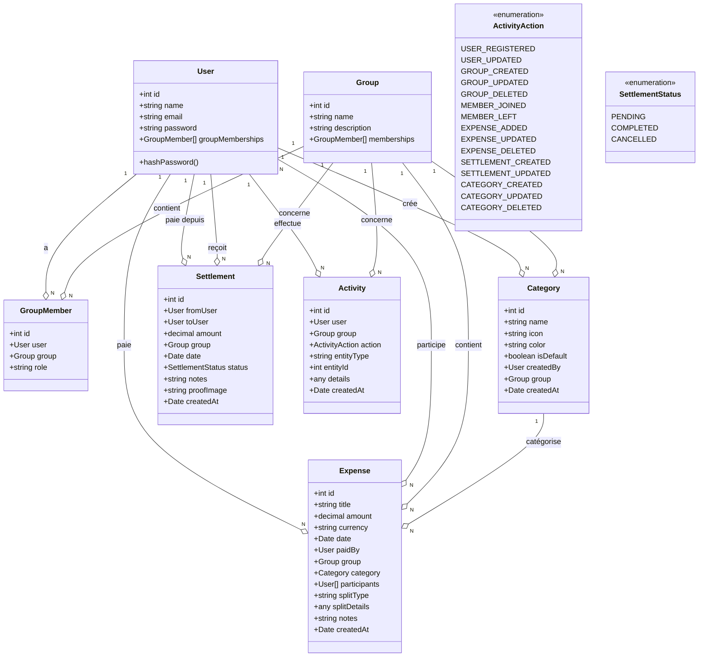

# 🧾 MiniSplit - Application de Gestion de Dépenses Partagées

## 📋 Table des Matières
- [Vue d'ensemble](#vue-densemble)
- [Architecture du Projet](#architecture-du-projet)
- [Technologies Utilisées](#technologies-utilisées)
- [Installation et Configuration](#installation-et-configuration)
- [Structure du Projet](#structure-du-projet)
- [Modèle de Base de Données](#modèle-de-base-de-données)
- [Diagramme de Classes](#diagramme-de-classes)
- [Modules et Fonctionnalités](#modules-et-fonctionnalités)
- [API Endpoints](#api-endpoints)
- [Gestion des Erreurs](#gestion-des-erreurs)
- [Validation des Données](#validation-des-données)
- [Scripts Disponibles](#scripts-disponibles)

---

## 🎯 Vue d'ensemble

**MiniSplit** est une application backend développée avec **NestJS** et **TypeScript** pour la gestion collaborative des dépenses partagées entre utilisateurs. L'application permet de :

- ✅ Créer et gérer des groupes de dépenses
- 💰 Enregistrer des dépenses avec division automatique
- 📊 Calculer les soldes et équilibres entre membres
- 💳 Enregistrer les remboursements entre utilisateurs
- 📂 Organiser les dépenses par catégories personnalisables
- 📝 Tracer toutes les activités des utilisateurs
- 🔐 Authentifier les utilisateurs avec hashage de mot de passe

---

## 🏗️ Architecture du Projet

Le projet suit l'architecture modulaire de **NestJS** avec une séparation claire des responsabilités :

```
Backend (NestJS + TypeScript + TypeORM + PostgreSQL)
├── Couche de Présentation (Controllers)
├── Couche de Logique Métier (Services)
├── Couche de Données (Entities + TypeORM)
└── Couche de Validation (DTOs + class-validator)
```

### Principes Architecturaux

- **Modularité** : Chaque fonctionnalité est encapsulée dans un module distinct
- **Injection de Dépendances** : Utilisation du système DI de NestJS
- **Séparation des Préoccupations** : Controllers → Services → Repositories
- **Validation Automatique** : Validation des entrées avec `class-validator`
- **Gestion d'Erreurs Centralisée** : Exceptions personnalisées avec messages en français

---

## 🛠️ Technologies Utilisées

### Framework Principal
- **NestJS 11.0.1** - Framework Node.js progressif
- **TypeScript 5.7.3** - Superset typé de JavaScript
- **Node.js** - Runtime JavaScript

### Base de Données
- **PostgreSQL** - Système de gestion de base de données relationnelle
- **TypeORM 0.3.27** - ORM pour TypeScript et JavaScript

### Validation et Transformation
- **class-validator 0.14.3** - Validation déclarative des objets
- **class-transformer 0.5.1** - Transformation d'objets plain en instances de classes

### Sécurité
- **bcrypt 6.0.0** - Hachage de mots de passe

### Configuration
- **@nestjs/config 4.0.2** - Gestion de configuration
- **dotenv 17.2.3** - Chargement de variables d'environnement

### Tests
- **Jest 30.0.0** - Framework de tests
- **Supertest 7.0.0** - Tests HTTP

---

## ⚙️ Installation et Configuration

### Prérequis
- Node.js >= 18.x
- PostgreSQL >= 14.x
- npm ou yarn

### 1. Installation des dépendances
```bash
npm install
```

### 2. Configuration de l'environnement

Créer un fichier `.env` à la racine du projet :

```env
# Configuration de la base de données
DB_HOST=localhost
DB_PORT=5432
DB_USERNAME=votre_utilisateur
DB_PASSWORD=votre_mot_de_passe
DB_NAME=minisplit_db

# Port de l'application
PORT=3000
```

### 3. Démarrage de la base de données

```bash
# Avec Docker (recommandé)
docker run --name minisplit-postgres \
  -e POSTGRES_PASSWORD=votre_mot_de_passe \
  -e POSTGRES_DB=minisplit_db \
  -p 5432:5432 \
  -d postgres:14
```

### 4. Lancement de l'application

```bash
# Mode développement (avec rechargement automatique)
npm run start:dev

# Mode production
npm run build
npm run start:prod

# Mode debug
npm run start:debug
```

L'application sera accessible sur `http://localhost:3000`

---

## 📂 Structure du Projet

```
backend/
├── src/
│   ├── main.ts                          # Point d'entrée de l'application
│   ├── app.module.ts                    # Module racine
│   │
│   ├── auth/                            # Module d'authentification
│   │   ├── auth.controller.ts           # Endpoints : /auth/register, /auth/login
│   │   ├── auth.service.ts              # Logique d'authentification
│   │   ├── auth.module.ts               # Configuration du module
│   │   └── dto/
│   │       ├── login.dto.ts             # DTO pour la connexion
│   │       └── register.dto.ts          # DTO pour l'inscription
│   │
│   ├── user/                            # Module de gestion des utilisateurs
│   │   ├── user.entity.ts               # Entité User (table)
│   │   ├── user.controller.ts           # Endpoints CRUD pour users
│   │   ├── user.service.ts              # Logique métier des utilisateurs
│   │   ├── user.module.ts               # Configuration du module
│   │   └── dto/
│   │       ├── create-user.dto.ts       # DTO pour création d'utilisateur
│   │       └── update-user.dto.ts       # DTO pour mise à jour d'utilisateur
│   │
│   ├── group/                           # Module de gestion des groupes
│   │   ├── group.entity.ts              # Entité Group (table)
│   │   ├── group.controller.ts          # Endpoints CRUD pour groups
│   │   ├── group.service.ts             # Logique métier des groupes
│   │   ├── group.module.ts              # Configuration du module
│   │   └── dto/
│   │       ├── create-group.dto.ts      # DTO pour création de groupe
│   │       └── update-group.dto.ts      # DTO pour mise à jour de groupe
│   │
│   ├── group-member/                    # Module de gestion des membres de groupes
│   │   ├── group-member.entity.ts       # Entité GroupMember (table de liaison)
│   │   ├── group-member.controller.ts   # Endpoints pour gérer les membres
│   │   ├── group-member.service.ts      # Logique d'ajout/retrait de membres
│   │   ├── group-member.module.ts       # Configuration du module
│   │   └── dto/
│   │       └── add-member.dto.ts        # DTO pour ajouter un membre
│   │
│   ├── expense/                         # Module de gestion des dépenses
│   │   ├── expense.entity.ts            # Entité Expense (table)
│   │   ├── expense.controller.ts        # Endpoints CRUD pour expenses
│   │   ├── expense.service.ts           # Logique métier des dépenses
│   │   ├── expense.module.ts            # Configuration du module
│   │   ├── expense.constants.ts         # Constantes (types de split, etc.)
│   │   └── dto/
│   │       ├── create-expense.dto.ts    # DTO pour création de dépense
│   │       └── update-expense.dto.ts    # DTO pour mise à jour de dépense
│   │
│   ├── balance/                         # Module de calcul des soldes
│   │   ├── balance.controller.ts        # Endpoint pour calculer les soldes
│   │   ├── balance.service.ts           # Algorithme de calcul des balances
│   │   └── balance.module.ts            # Configuration du module
│   │
│   ├── category/                        # Module de gestion des catégories
│   │   ├── category.entity.ts           # Entité Category (table)
│   │   ├── category.controller.ts       # Endpoints CRUD pour categories
│   │   ├── category.service.ts          # Logique métier des catégories
│   │   ├── category.module.ts           # Configuration du module
│   │   └── dto/
│   │       ├── create-category.dto.ts   # DTO pour création de catégorie
│   │       └── update-category.dto.ts   # DTO pour mise à jour de catégorie
│   │
│   ├── settlement/                      # Module de gestion des remboursements
│   │   ├── settlement.entity.ts         # Entité Settlement (table)
│   │   ├── settlement.controller.ts     # Endpoints CRUD pour settlements
│   │   ├── settlement.service.ts        # Logique métier des remboursements
│   │   ├── settlement.module.ts         # Configuration du module
│   │   └── dto/
│   │       ├── create-settlement.dto.ts # DTO pour création de remboursement
│   │       └── update-settlement.dto.ts # DTO pour mise à jour de remboursement
│   │
│   ├── activity/                        # Module de suivi des activités
│   │   ├── activity.entity.ts           # Entité Activity (table de log)
│   │   ├── activity.controller.ts       # Endpoints pour consulter les activités
│   │   ├── activity.service.ts          # Logique d'enregistrement d'activité
│   │   ├── activity.module.ts           # Configuration du module
│   │   └── dto/
│   │       └── create-activity.dto.ts   # DTO pour création d'activité
│   │
│   └── common/                          # Utilitaires partagés
│       └── exceptions.ts                # Exceptions personnalisées
│
├── test/                                # Tests end-to-end
│   ├── app.e2e-spec.ts
│   └── jest-e2e.json
│
├── nest-cli.json                        # Configuration NestJS CLI
├── tsconfig.json                        # Configuration TypeScript
├── tsconfig.build.json                  # Configuration build TypeScript
└── package.json                         # Dépendances et scripts
```

---

## 🗄️ Modèle de Base de Données

### Schéma Relationnel

```
┌─────────────────┐
│      User       │
├─────────────────┤
│ PK  id          │
│     name        │
│ UK  email       │
│     password    │
└─────────────────┘
         │
         │ 1
         │
         │ N
┌─────────────────┐       N     ┌─────────────────┐     1   ┌─────────────────┐
│  GroupMember    │─────────────│     Expense     │─────────│     Group       │
├─────────────────┤             ├─────────────────┤         ├─────────────────┤
│ PK  id          │             │ PK  id          │         │ PK  id          │
│ FK  userId      │             │     title       │         │     name        │
│ FK  groupId     │             │     amount      │         │     description │
│     role        │             │     currency    │         └─────────────────┘
└─────────────────┘             │     date        │                 │
         │                      │     splitType   │                 │ 1
         │ N                    │     splitDetails│                 │
         │                      │     notes       │                 │
         │ 1                    │     createdAt   │                 │ N
┌─────────────────┐             │ FK  paidBy      │         ┌─────────────────┐
│     Group       │             │ FK  groupId     │         │    Category     │
└─────────────────┘             │ FK  categoryId  │         ├─────────────────┤
         │                      └─────────────────┘         │ PK  id          │
         │ 1                            │                   │     name        │
         │                              │ N                 │     icon        │
         │ N                            │                   │     color       │
┌─────────────────┐                     │ N                 │     isDefault   │
│   Settlement    │             ┌───────────────┐           │     createdAt   │
├─────────────────┤             │  expense_     │           │ FK  createdBy   │
│ PK  id          │             │ participants  │           │ FK  groupId     │
│     amount      │             ├───────────────┤           └─────────────────┘
│     date        │             │ FK  expense_id│
│     status      │             │ FK  user_id   │
│     notes       │             └───────────────┘
│     proofImage  │
│     createdAt   │
│ FK  fromUserId  │
│ FK  toUserId    │
│ FK  groupId     │
└─────────────────┘
         │
         │ N
         │
         │ 1
┌─────────────────┐
│    Activity     │
├─────────────────┤
│ PK  id          │
│     action      │
│     entityType  │
│     entityId    │
│     details     │
│     createdAt   │
│ FK  userId      │
│ FK  groupId     │
└─────────────────┘
```

### Description des Tables

#### 📊 **Table `user`**
Stocke les informations des utilisateurs de l'application.

| Colonne    | Type         | Description                           |
|------------|--------------|---------------------------------------|
| `id`       | INT (PK)     | Identifiant unique auto-incrémenté   |
| `name`     | VARCHAR      | Nom de l'utilisateur                 |
| `email`    | VARCHAR (UK) | Email (unique, utilisé pour login)   |
| `password` | VARCHAR      | Mot de passe hashé avec bcrypt       |

**Hooks** :
- `@BeforeInsert()` : Hash automatique du mot de passe avant insertion

---

#### 📊 **Table `group`**
Représente un groupe de dépenses partagées.

| Colonne       | Type     | Description                      |
|---------------|----------|----------------------------------|
| `id`          | INT (PK) | Identifiant unique              |
| `name`        | VARCHAR  | Nom du groupe                   |
| `description` | TEXT     | Description optionnelle         |

---

#### 📊 **Table `group_member`**
Table de liaison Many-to-Many entre `user` et `group`.

| Colonne   | Type         | Description                           |
|-----------|--------------|---------------------------------------|
| `id`      | INT (PK)     | Identifiant unique                   |
| `userId`  | INT (FK)     | Référence vers `user.id`             |
| `groupId` | INT (FK)     | Référence vers `group.id`            |
| `role`    | VARCHAR      | Rôle dans le groupe (défaut: 'member')|

**Relations** :
- `ManyToOne` vers `User`
- `ManyToOne` vers `Group`

---

#### 📊 **Table `expense`**
Enregistre toutes les dépenses effectuées dans les groupes.

| Colonne        | Type          | Description                               |
|----------------|---------------|-------------------------------------------|
| `id`           | INT (PK)      | Identifiant unique                       |
| `title`        | VARCHAR       | Titre/description de la dépense          |
| `amount`       | DECIMAL(10,3) | Montant de la dépense                    |
| `currency`     | VARCHAR       | Devise (défaut: 'TND')                   |
| `date`         | TIMESTAMP     | Date de la dépense                       |
| `splitType`    | VARCHAR       | Type de division (défaut: 'equal')       |
| `splitDetails` | JSONB         | Détails de division personnalisée        |
| `notes`        | TEXT          | Notes supplémentaires                    |
| `createdAt`    | TIMESTAMP     | Date de création de l'enregistrement     |
| `paidBy`       | INT (FK)      | Utilisateur qui a payé                   |
| `groupId`      | INT (FK)      | Groupe concerné                          |
| `categoryId`   | INT (FK)      | Catégorie de la dépense (optionnelle)    |

**Relations** :
- `ManyToOne` vers `User` (paidBy)
- `ManyToOne` vers `Group`
- `ManyToOne` vers `Category`
- `ManyToMany` vers `User` (participants via table `expense_participants`)

---

#### 📊 **Table `expense_participants`**
Table de liaison Many-to-Many entre `expense` et `user` (participants).

| Colonne      | Type     | Description                    |
|--------------|----------|--------------------------------|
| `expense_id` | INT (FK) | Référence vers `expense.id`   |
| `user_id`    | INT (FK) | Référence vers `user.id`      |

---

#### 📊 **Table `category`**
Catégories pour organiser les dépenses.

| Colonne      | Type      | Description                                |
|--------------|-----------|------------------------------------------- |
| `id`         | INT (PK)  | Identifiant unique                        |
| `name`       | VARCHAR   | Nom de la catégorie                       |
| `icon`       | VARCHAR   | Emoji/icône (défaut: '📦')                |
| `color`      | VARCHAR   | Couleur hexadécimale (défaut: '#6366f1') |
| `isDefault`  | BOOLEAN   | Catégorie par défaut ? (défaut: false)    |
| `createdAt`  | TIMESTAMP | Date de création                          |
| `createdBy`  | INT (FK)  | Utilisateur créateur (optionnel)          |
| `groupId`    | INT (FK)  | Groupe associé (optionnel, null = global) |

**Relations** :
- `ManyToOne` vers `User` (createdBy)
- `ManyToOne` vers `Group`

---

#### 📊 **Table `settlement`**
Enregistre les remboursements entre utilisateurs.

| Colonne      | Type          | Description                              |
|--------------|---------------|------------------------------------------|
| `id`         | INT (PK)      | Identifiant unique                      |
| `amount`     | DECIMAL(10,3) | Montant du remboursement                |
| `date`       | TIMESTAMP     | Date du remboursement                   |
| `status`     | ENUM          | Statut : pending, completed, cancelled  |
| `notes`      | TEXT          | Notes optionnelles                      |
| `proofImage` | VARCHAR       | URL de la preuve de paiement (optionnel)|
| `createdAt`  | TIMESTAMP     | Date de création de l'enregistrement    |
| `fromUserId` | INT (FK)      | Utilisateur qui paie                    |
| `toUserId`   | INT (FK)      | Utilisateur qui reçoit                  |
| `groupId`    | INT (FK)      | Groupe concerné                         |

**Relations** :
- `ManyToOne` vers `User` (fromUser)
- `ManyToOne` vers `User` (toUser)
- `ManyToOne` vers `Group`

**Enum `SettlementStatus`** :
- `PENDING` : En attente
- `COMPLETED` : Complété
- `CANCELLED` : Annulé

---

#### 📊 **Table `activity`**
Journal d'audit de toutes les actions effectuées dans l'application.

| Colonne      | Type      | Description                               |
|--------------|-----------|-------------------------------------------|
| `id`         | INT (PK)  | Identifiant unique                       |
| `action`     | ENUM      | Type d'action (voir ActivityAction)      |
| `entityType` | VARCHAR   | Type d'entité concernée (optionnel)      |
| `entityId`   | INT       | ID de l'entité concernée (optionnel)     |
| `details`    | JSONB     | Détails supplémentaires                  |
| `createdAt`  | TIMESTAMP | Date et heure de l'action                |
| `userId`     | INT (FK)  | Utilisateur ayant effectué l'action      |
| `groupId`    | INT (FK)  | Groupe concerné (optionnel)              |

**Relations** :
- `ManyToOne` vers `User`
- `ManyToOne` vers `Group`

**Enum `ActivityAction`** :
- `USER_REGISTERED` : Utilisateur inscrit
- `USER_UPDATED` : Utilisateur mis à jour
- `GROUP_CREATED` : Groupe créé
- `GROUP_UPDATED` : Groupe mis à jour
- `GROUP_DELETED` : Groupe supprimé
- `MEMBER_JOINED` : Membre ajouté au groupe
- `MEMBER_LEFT` : Membre retiré du groupe
- `EXPENSE_ADDED` : Dépense ajoutée
- `EXPENSE_UPDATED` : Dépense mise à jour
- `EXPENSE_DELETED` : Dépense supprimée
- `SETTLEMENT_CREATED` : Remboursement créé
- `SETTLEMENT_UPDATED` : Remboursement mis à jour
- `CATEGORY_CREATED` : Catégorie créée
- `CATEGORY_UPDATED` : Catégorie mise à jour
- `CATEGORY_DELETED` : Catégorie supprimée

---

## 📐 Diagramme de Classes



---

## 🔧 Modules et Fonctionnalités

### 1️⃣ **Module Auth** (`/auth`)

**Responsabilité** : Authentification et inscription des utilisateurs

#### **AuthService**
- `register(registerDto)` : Créer un nouveau compte utilisateur
  - Vérifie l'unicité de l'email
  - Hash le mot de passe avec bcrypt
  - Retourne les informations de l'utilisateur (sans le mot de passe)
  
- `login(loginDto)` : Authentifier un utilisateur
  - Valide les credentials (email + mot de passe)
  - Compare le mot de passe avec bcrypt
  - Retourne les informations de l'utilisateur si authentifié

- `validateUser(email, password)` : Valider les credentials
  - Recherche l'utilisateur par email
  - Vérifie le mot de passe hashé
  - Retourne l'utilisateur ou null

#### **AuthController**
- `POST /auth/register` : Inscription d'un nouvel utilisateur
- `POST /auth/login` : Connexion d'un utilisateur existant

---

### 2️⃣ **Module User** (`/users`)

**Responsabilité** : Gestion complète des utilisateurs

#### **UserService**
- `create(userData)` : Créer un utilisateur
  - Valide le format de l'email (regex)
  - Vérifie l'unicité de l'email
  - Valide la longueur du mot de passe (min 6 caractères)
  - Hash automatique du mot de passe via `@BeforeInsert`

- `findAll()` : Récupérer tous les utilisateurs

- `findById(id)` : Récupérer un utilisateur par ID
  - Valide l'ID (> 0)
  - Lance `NotFoundException` si introuvable

- `findByName(name)` : Récupérer un utilisateur par nom
  - Lance `NotFoundException` si introuvable

- `findByEmail(email)` : Récupérer un utilisateur par email
  - Utilisé par le système d'authentification

- `update(id, updateData)` : Mettre à jour un utilisateur
  - Vérifie l'existence de l'utilisateur
  - Valide le nouvel email (format + unicité)
  - Valide la longueur du nouveau mot de passe

- `delete(id)` : Supprimer un utilisateur
  - Vérifie l'existence avant suppression

#### **UserController**
- `POST /users` : Créer un nouvel utilisateur
- `GET /users` : Lister tous les utilisateurs
- `GET /users/:id` : Récupérer un utilisateur par ID
- `GET /users/name/:name` : Récupérer un utilisateur par nom
- `PUT /users/:id` : Mettre à jour un utilisateur
- `DELETE /users/:id` : Supprimer un utilisateur

---

### 3️⃣ **Module Group** (`/groups`)

**Responsabilité** : Gestion des groupes de dépenses

#### **GroupService**
- `create(data)` : Créer un groupe
  - Valide le nom (non vide)
  - Vérifie l'unicité du nom de groupe
  - Lance `DuplicateException` si le nom existe déjà

- `findAll()` : Récupérer tous les groupes

- `findById(id)` : Récupérer un groupe par ID
  - Lance `NotFoundException` si introuvable

- `findByName(name)` : Récupérer un groupe par nom
  - Lance `NotFoundException` si introuvable

- `update(id, updateData)` : Mettre à jour un groupe
  - Vérifie l'existence du groupe
  - Valide le nouveau nom (unicité)

- `delete(id)` : Supprimer un groupe
  - Vérifie l'existence avant suppression

#### **GroupController**
- `POST /groups` : Créer un nouveau groupe
- `GET /groups` : Lister tous les groupes
- `GET /groups/:id` : Récupérer un groupe par ID
- `GET /groups/name/:name` : Récupérer un groupe par nom
- `PUT /groups/:id` : Mettre à jour un groupe
- `DELETE /groups/:id` : Supprimer un groupe

---

### 4️⃣ **Module GroupMember** (`/group-members`)

**Responsabilité** : Gestion des membres dans les groupes

#### **GroupMemberService**
- `addMember(data)` : Ajouter un membre à un groupe
  - Vérifie que l'utilisateur n'est pas déjà membre
  - Lance `BusinessException` si déjà membre
  - Crée la relation User ↔ Group

- `removeMember(id)` : Retirer un membre d'un groupe
  - Vérifie l'existence de l'appartenance
  - Supprime la relation

- `findMembersByGroup(groupId)` : Lister tous les membres d'un groupe
  - Retourne les utilisateurs avec leurs informations

- `findGroupsByUser(userId)` : Lister tous les groupes d'un utilisateur
  - Retourne les groupes avec leurs informations

#### **GroupMemberController**
- `POST /group-members` : Ajouter un membre à un groupe
- `DELETE /group-members/:id` : Retirer un membre d'un groupe
- `GET /group-members/group/:groupId` : Lister les membres d'un groupe
- `GET /group-members/user/:userId` : Lister les groupes d'un utilisateur

---

### 5️⃣ **Module Expense** (`/expenses`)

**Responsabilité** : Gestion des dépenses partagées

#### **ExpenseService**
- `create(data)` : Créer une dépense
  - Associe le payeur (paidBy)
  - Associe le groupe
  - Associe les participants (tableau d'IDs)
  - Associe la catégorie (optionnel)
  - Définit la date (défaut: maintenant)

- `findAll()` : Récupérer toutes les dépenses
  - Inclut les relations : paidBy, group, participants

- `findById(id)` : Récupérer une dépense par ID
  - Lance `NotFoundException` si introuvable

- `findByGroup(groupId)` : Récupérer toutes les dépenses d'un groupe
  - Tri par date décroissante

- `update(id, updateData)` : Mettre à jour une dépense
  - Valide le montant (doit être positif)

- `delete(id)` : Supprimer une dépense

#### **ExpenseController**
- `POST /expenses` : Créer une nouvelle dépense
- `GET /expenses` : Lister toutes les dépenses
- `GET /expenses/:id` : Récupérer une dépense par ID
- `GET /expenses/group/:groupId` : Lister les dépenses d'un groupe
- `PUT /expenses/:id` : Mettre à jour une dépense
- `DELETE /expenses/:id` : Supprimer une dépense

---

### 6️⃣ **Module Balance** (`/balances`)

**Responsabilité** : Calcul des soldes et équilibres de groupe

#### **BalanceService**
- `calculateGroupBalances(groupId)` : Calculer les balances d'un groupe
  - Récupère toutes les dépenses du groupe
  - Pour chaque dépense :
    - Calcule la part par personne (montant / nb participants)
    - Ajoute le montant payé au payeur
    - Ajoute la part à chaque participant
  - Calcule le solde final pour chaque utilisateur : `paid - share`
  - Retourne :
    - `totalSpent` : Total dépensé par le groupe
    - `balances[]` : Tableau des soldes par utilisateur
      - `userId` : ID de l'utilisateur
      - `userName` : Nom de l'utilisateur
      - `paid` : Montant total payé
      - `share` : Part totale à payer
      - `balance` : Solde (positif = créditeur, négatif = débiteur)

#### **BalanceController**
- `GET /balances/group/:groupId` : Calculer et récupérer les balances d'un groupe

**Exemple de réponse** :
```json
{
  "groupId": 1,
  "totalSpent": 450.50,
  "balances": [
    {
      "userId": 1,
      "userName": "Alice",
      "paid": 300.00,
      "share": 150.17,
      "balance": 149.83
    },
    {
      "userId": 2,
      "userName": "Bob",
      "paid": 150.50,
      "share": 150.17,
      "balance": 0.33
    },
    {
      "userId": 3,
      "userName": "Charlie",
      "paid": 0.00,
      "share": 150.16,
      "balance": -150.16
    }
  ]
}
```

---

### 7️⃣ **Module Category** (`/categories`)

**Responsabilité** : Gestion des catégories de dépenses

#### **CategoryService**
- `create(data)` : Créer une catégorie
  - Définit l'icône par défaut ('📦')
  - Définit la couleur par défaut ('#6366f1')
  - Associe l'utilisateur créateur (optionnel)
  - Associe le groupe (optionnel, null = catégorie globale)

- `findAll()` : Récupérer toutes les catégories
  - Tri : catégories par défaut d'abord, puis par nom

- `findByGroup(groupId)` : Récupérer les catégories d'un groupe
  - Inclut les catégories du groupe ET les catégories par défaut (globales)

- `findById(id)` : Récupérer une catégorie par ID

- `update(id, data)` : Mettre à jour une catégorie
  - Empêche la modification des catégories par défaut
  - Lance `ValidationException` si tentative de modification d'une catégorie par défaut

- `delete(id)` : Supprimer une catégorie
  - Empêche la suppression des catégories par défaut

#### **CategoryController**
- `POST /categories` : Créer une nouvelle catégorie
- `GET /categories` : Lister toutes les catégories
- `GET /categories/:id` : Récupérer une catégorie par ID
- `GET /categories/group/:groupId` : Lister les catégories d'un groupe
- `PUT /categories/:id` : Mettre à jour une catégorie
- `DELETE /categories/:id` : Supprimer une catégorie

---

### 8️⃣ **Module Settlement** (`/settlements`)

**Responsabilité** : Gestion des remboursements entre utilisateurs

#### **SettlementService**
- `create(data)` : Créer un remboursement
  - Valide : fromUser != toUser
  - Lance `ValidationException` si l'utilisateur tente de se rembourser lui-même
  - Définit le statut par défaut : 'completed'
  - Supporte les preuves de paiement (proofImage)

- `findAll()` : Récupérer tous les remboursements
  - Tri par date décroissante

- `findByGroup(groupId)` : Récupérer les remboursements d'un groupe

- `findByUser(userId)` : Récupérer les remboursements d'un utilisateur
  - Inclut les remboursements où l'utilisateur est fromUser OU toUser

- `findById(id)` : Récupérer un remboursement par ID

- `update(id, data)` : Mettre à jour un remboursement
  - Permet de modifier le statut, les notes, etc.

- `delete(id)` : Supprimer un remboursement

#### **SettlementController**
- `POST /settlements` : Créer un nouveau remboursement
- `GET /settlements` : Lister tous les remboursements
- `GET /settlements/:id` : Récupérer un remboursement par ID
- `GET /settlements/group/:groupId` : Lister les remboursements d'un groupe
- `GET /settlements/user/:userId` : Lister les remboursements d'un utilisateur
- `PUT /settlements/:id` : Mettre à jour un remboursement
- `DELETE /settlements/:id` : Supprimer un remboursement

---

### 9️⃣ **Module Activity** (`/activities`)

**Responsabilité** : Journalisation de toutes les actions dans l'application

#### **ActivityService**
- `create(data)` : Créer une entrée d'activité
  - Enregistre l'action effectuée
  - Associe l'utilisateur
  - Associe le groupe (optionnel)
  - Stocke les détails supplémentaires dans le champ JSONB

- `findAll()` : Récupérer les dernières activités (limité à 100)
  - Tri par date décroissante

- `findByGroup(groupId)` : Récupérer les activités d'un groupe

- `findByUser(userId)` : Récupérer les activités d'un utilisateur

#### **ActivityController**
- `POST /activities` : Créer une nouvelle activité (log manuel)
- `GET /activities` : Lister les activités récentes
- `GET /activities/group/:groupId` : Lister les activités d'un groupe
- `GET /activities/user/:userId` : Lister les activités d'un utilisateur

**Utilisation typique** :
Les activités sont généralement créées automatiquement lors d'actions importantes :
```typescript
await activityService.create({
  userId: currentUser.id,
  groupId: group.id,
  action: ActivityAction.EXPENSE_ADDED,
  entityType: 'expense',
  entityId: expense.id,
  details: { amount: expense.amount, title: expense.title }
});
```

---

## 🔌 API Endpoints

### 🔐 **Authentication**

| Méthode | Endpoint          | Description              | Body                                    |
|---------|-------------------|--------------------------|----------------------------------------|
| POST    | `/auth/register`  | Inscription utilisateur  | `{ name, email, password }`            |
| POST    | `/auth/login`     | Connexion utilisateur    | `{ email, password }`                  |

---

### 👤 **Users**

| Méthode | Endpoint             | Description                      | Body                          |
|---------|----------------------|----------------------------------|-------------------------------|
| POST    | `/users`             | Créer un utilisateur            | `{ name, email, password }`   |
| GET     | `/users`             | Lister tous les utilisateurs    | -                             |
| GET     | `/users/:id`         | Récupérer un utilisateur par ID | -                             |
| GET     | `/users/name/:name`  | Récupérer un utilisateur par nom| -                             |
| PUT     | `/users/:id`         | Mettre à jour un utilisateur    | `{ name?, email?, password? }`|
| DELETE  | `/users/:id`         | Supprimer un utilisateur        | -                             |

---

### 👥 **Groups**

| Méthode | Endpoint             | Description                  | Body                            |
|---------|----------------------|------------------------------|---------------------------------|
| POST    | `/groups`            | Créer un groupe             | `{ name, description? }`        |
| GET     | `/groups`            | Lister tous les groupes     | -                               |
| GET     | `/groups/:id`        | Récupérer un groupe par ID  | -                               |
| GET     | `/groups/name/:name` | Récupérer un groupe par nom | -                               |
| PUT     | `/groups/:id`        | Mettre à jour un groupe     | `{ name?, description? }`       |
| DELETE  | `/groups/:id`        | Supprimer un groupe         | -                               |

---

### 🔗 **Group Members**

| Méthode | Endpoint                         | Description                          | Body                      |
|---------|----------------------------------|--------------------------------------|---------------------------|
| POST    | `/group-members`                 | Ajouter un membre à un groupe       | `{ userId, groupId }`     |
| DELETE  | `/group-members/:id`             | Retirer un membre d'un groupe       | -                         |
| GET     | `/group-members/group/:groupId`  | Lister les membres d'un groupe      | -                         |
| GET     | `/group-members/user/:userId`    | Lister les groupes d'un utilisateur | -                         |

---

### 💰 **Expenses**

| Méthode | Endpoint                    | Description                         | Body                                                                 |
|---------|----------------------------|-------------------------------------|----------------------------------------------------------------------|
| POST    | `/expenses`                | Créer une dépense                  | `{ title, amount, paidBy, groupId, participants[], description?, date?, categoryId? }` |
| GET     | `/expenses`                | Lister toutes les dépenses         | -                                                                    |
| GET     | `/expenses/:id`            | Récupérer une dépense par ID       | -                                                                    |
| GET     | `/expenses/group/:groupId` | Lister les dépenses d'un groupe    | -                                                                    |
| PUT     | `/expenses/:id`            | Mettre à jour une dépense          | `{ title?, amount?, description?, ... }`                             |
| DELETE  | `/expenses/:id`            | Supprimer une dépense              | -                                                                    |

**Exemple de création de dépense** :
```json
{
  "title": "Restaurant",
  "amount": 120.50,
  "paidBy": 1,
  "groupId": 2,
  "participants": [1, 2, 3],
  "description": "Dîner entre amis",
  "categoryId": 5,
  "date": "2023-12-01T19:30:00Z"
}
```

---

### 📊 **Balances**

| Méthode | Endpoint                     | Description                         |
|---------|------------------------------|-------------------------------------|
| GET     | `/balances/group/:groupId`   | Calculer les balances d'un groupe  |

---

### 📂 **Categories**

| Méthode | Endpoint                        | Description                          | Body                                              |
|---------|---------------------------------|--------------------------------------|---------------------------------------------------|
| POST    | `/categories`                   | Créer une catégorie                 | `{ name, icon?, color?, groupId?, createdBy? }`   |
| GET     | `/categories`                   | Lister toutes les catégories        | -                                                 |
| GET     | `/categories/:id`               | Récupérer une catégorie par ID      | -                                                 |
| GET     | `/categories/group/:groupId`    | Lister les catégories d'un groupe   | -                                                 |
| PUT     | `/categories/:id`               | Mettre à jour une catégorie         | `{ name?, icon?, color? }`                        |
| DELETE  | `/categories/:id`               | Supprimer une catégorie             | -                                                 |

---

### 💳 **Settlements**

| Méthode | Endpoint                         | Description                              | Body                                                           |
|---------|----------------------------------|------------------------------------------|----------------------------------------------------------------|
| POST    | `/settlements`                   | Créer un remboursement                  | `{ fromUserId, toUserId, amount, groupId, date?, status?, notes?, proofImage? }` |
| GET     | `/settlements`                   | Lister tous les remboursements          | -                                                              |
| GET     | `/settlements/:id`               | Récupérer un remboursement par ID       | -                                                              |
| GET     | `/settlements/group/:groupId`    | Lister les remboursements d'un groupe   | -                                                              |
| GET     | `/settlements/user/:userId`      | Lister les remboursements d'un utilisateur | -                                                           |
| PUT     | `/settlements/:id`               | Mettre à jour un remboursement          | `{ status?, notes?, proofImage? }`                             |
| DELETE  | `/settlements/:id`               | Supprimer un remboursement              | -                                                              |

---

### 📝 **Activities**

| Méthode | Endpoint                      | Description                         | Body                                                    |
|---------|-------------------------------|-------------------------------------|---------------------------------------------------------|
| POST    | `/activities`                 | Créer une activité                 | `{ userId, action, groupId?, entityType?, entityId?, details? }` |
| GET     | `/activities`                 | Lister les activités récentes      | -                                                       |
| GET     | `/activities/group/:groupId`  | Lister les activités d'un groupe   | -                                                       |
| GET     | `/activities/user/:userId`    | Lister les activités d'un utilisateur | -                                                    |

---

## ⚠️ Gestion des Erreurs

Le projet utilise des **exceptions personnalisées** pour une gestion cohérente des erreurs.

### Classes d'Exception (`src/common/exceptions.ts`)

#### 1. **NotFoundException**
Lancée lorsqu'une ressource n'est pas trouvée.

```typescript
throw new NotFoundException('Utilisateur', 123);
// HTTP 404 : "Utilisateur introuvable (ID: 123)"
```

#### 2. **ValidationException**
Lancée pour les erreurs de validation des données.

```typescript
throw new ValidationException('Email invalide');
// HTTP 400 : "Email invalide"
```

#### 3. **DuplicateException**
Lancée lors de conflits d'unicité (duplicate key).

```typescript
throw new DuplicateException('Utilisateur', 'email', 'test@example.com');
// HTTP 409 : "Utilisateur avec email "test@example.com" existe déjà"
```

#### 4. **BusinessException**
Lancée pour les erreurs métier spécifiques.

```typescript
throw new BusinessException('Utilisateur déjà membre du groupe');
// HTTP 400 : "Utilisateur déjà membre du groupe"
```

### Codes de Statut HTTP

| Code | Statut              | Utilisation                                  |
|------|---------------------|----------------------------------------------|
| 200  | OK                  | Requête réussie (GET, PUT, DELETE)          |
| 201  | Created             | Ressource créée avec succès (POST)          |
| 400  | Bad Request         | Données invalides / Erreur de validation    |
| 401  | Unauthorized        | Authentification échouée                    |
| 404  | Not Found           | Ressource introuvable                       |
| 409  | Conflict            | Conflit d'unicité (duplicate)               |
| 500  | Internal Server Error | Erreur serveur non gérée                  |

---

## ✅ Validation des Données

Le projet utilise `class-validator` pour la validation automatique des DTOs.

### Décorateurs de Validation Utilisés

| Décorateur           | Description                                  | Exemple                                    |
|----------------------|----------------------------------------------|--------------------------------------------|
| `@IsNotEmpty()`      | Champ requis (non vide)                     | `@IsNotEmpty({ message: 'Nom requis' })`  |
| `@IsString()`        | Doit être une chaîne de caractères          | `@IsString()`                              |
| `@IsEmail()`         | Doit être un email valide                   | `@IsEmail({}, { message: 'Email invalide' })` |
| `@IsNumber()`        | Doit être un nombre                         | `@IsNumber()`                              |
| `@IsBoolean()`       | Doit être un booléen                        | `@IsBoolean()`                             |
| `@IsEnum()`          | Doit être une valeur d'un enum              | `@IsEnum(ActivityAction)`                  |
| `@IsArray()`         | Doit être un tableau                        | `@IsArray()`                               |
| `@IsOptional()`      | Champ optionnel                             | `@IsOptional()`                            |
| `@IsDateString()`    | Doit être une date ISO 8601                 | `@IsDateString()`                          |
| `@Min()`             | Valeur minimale pour un nombre              | `@Min(0.01)`                               |
| `@MinLength()`       | Longueur minimale pour une chaîne           | `@MinLength(6)`                            |
| `@ArrayMinSize()`    | Taille minimale d'un tableau                | `@ArrayMinSize(1)`                         |

### Exemple de DTO avec Validation

```typescript
export class CreateExpenseDto {
  @IsNotEmpty({ message: 'Titre requis' })
  @IsString({ message: 'Le titre doit être une chaîne de caractères' })
  title: string;

  @IsNotEmpty({ message: 'Montant requis' })
  @IsNumber({}, { message: 'Le montant doit être un nombre' })
  @Min(0.01, { message: 'Montant invalide (doit être positif)' })
  amount: number;

  @IsNotEmpty({ message: 'Au moins un participant requis' })
  @IsArray({ message: 'Les participants doivent être un tableau' })
  @ArrayMinSize(1, { message: 'Au moins un participant requis' })
  @IsNumber({}, { each: true, message: 'Chaque participant doit être un ID valide' })
  participants: number[];

  @IsOptional()
  @IsDateString({}, { message: 'Format de date invalide' })
  date?: string;
}
```

### Configuration Globale de Validation (`main.ts`)

```typescript
app.useGlobalPipes(new ValidationPipe({
  whitelist: true,              // Supprime les propriétés non définies dans le DTO
  forbidNonWhitelisted: false,  // N'empêche pas l'envoi de propriétés supplémentaires
  transform: true,              // Transforme automatiquement les types (string → number)
  transformOptions: {
    enableImplicitConversion: true, // Conversion implicite des types
  },
}));
```

---

## 🎬 Scripts Disponibles

### Développement
```bash
# Démarrer en mode développement (avec rechargement automatique)
npm run start:dev

# Démarrer en mode debug
npm run start:debug
```

### Production
```bash
# Compiler le projet
npm run build

# Lancer la version compilée
npm run start:prod
```

### Tests
```bash
# Lancer tous les tests unitaires
npm run test

# Tests en mode watch (rechargement automatique)
npm run test:watch

# Générer un rapport de couverture
npm run test:cov

# Tests end-to-end
npm run test:e2e

# Tests en mode debug
npm run test:debug
```

### Qualité du Code
```bash
# Formater le code avec Prettier
npm run format

# Vérifier et corriger avec ESLint
npm run lint
```

---

## 🔒 Sécurité

### Hachage des Mots de Passe
- Utilisation de **bcrypt** avec un salt de 10 rounds
- Hachage automatique via hook `@BeforeInsert()` dans l'entité `User`
- Les mots de passe ne sont jamais retournés dans les réponses API (décorateur `@Exclude()`)

### Serialization
- Utilisation de `ClassSerializerInterceptor` global
- Le champ `password` est automatiquement exclu des réponses

### Validation
- Validation stricte de tous les inputs via DTOs
- Messages d'erreur personnalisés en français
- Validation des types, formats, longueurs, et plages de valeurs

---

## 📦 Dépendances Principales

### Production
```json
{
  "@nestjs/common": "^11.0.1",
  "@nestjs/core": "^11.0.1",
  "@nestjs/config": "^4.0.2",
  "@nestjs/platform-express": "^11.0.1",
  "@nestjs/typeorm": "^11.0.0",
  "typeorm": "^0.3.27",
  "pg": "^8.16.3",
  "bcrypt": "^6.0.0",
  "class-validator": "^0.14.3",
  "class-transformer": "^0.5.1",
  "dotenv": "^17.2.3",
  "reflect-metadata": "^0.2.2",
  "rxjs": "^7.8.1"
}
```

### Développement
```json
{
  "@nestjs/cli": "^11.0.0",
  "@nestjs/schematics": "^11.0.0",
  "@nestjs/testing": "^11.0.1",
  "typescript": "^5.7.3",
  "jest": "^30.0.0",
  "ts-jest": "^29.2.5",
  "ts-node": "^10.9.2",
  "supertest": "^7.0.0"
}
```

---

## 📚 Concepts Clés de NestJS

### Modules
Unité d'organisation qui encapsule des fonctionnalités connexes (controllers, services, entities).

### Controllers
Gèrent les requêtes HTTP entrantes et renvoient des réponses.

### Services (Providers)
Contiennent la logique métier et peuvent être injectés via DI.

### Entities
Définissent les modèles de données mappés aux tables de la base de données via TypeORM.

### DTOs (Data Transfer Objects)
Définissent la structure des données échangées entre client et serveur, avec validation intégrée.

### Pipes
Transforment ou valident les données (ex: `ValidationPipe`).

### Interceptors
Interceptent les requêtes/réponses pour ajouter de la logique (ex: `ClassSerializerInterceptor`).

---

## 🧪 Tests

### Structure des Tests
```
backend/
├── src/
│   └── **/*.spec.ts          # Tests unitaires
└── test/
    ├── app.e2e-spec.ts       # Tests end-to-end
    └── jest-e2e.json         # Configuration Jest E2E
```

### Lancer les Tests
```bash
# Tests unitaires
npm run test

# Tests E2E
npm run test:e2e

# Couverture de code
npm run test:cov
```

---

## 🚀 Déploiement

### Étapes de Déploiement en Production

1. **Compiler le projet**
```bash
npm run build
```

2. **Configurer les variables d'environnement de production**
```env
DB_HOST=production-db-host
DB_PORT=5432
DB_USERNAME=prod_user
DB_PASSWORD=strong_password
DB_NAME=minisplit_prod
PORT=3000
NODE_ENV=production
```

3. **Exécuter les migrations (si nécessaire)**
```bash
npm run typeorm migration:run
```

4. **Démarrer l'application**
```bash
npm run start:prod
```

### Recommandations de Production

- ✅ Désactiver `synchronize: true` dans TypeORM (utiliser des migrations)
- ✅ Configurer HTTPS avec un reverse proxy (Nginx, Apache)
- ✅ Utiliser un gestionnaire de processus (PM2, systemd)
- ✅ Mettre en place des logs centralisés
- ✅ Configurer des sauvegardes automatiques de la base de données
- ✅ Implémenter un système de monitoring (Prometheus, Grafana)
- ✅ Configurer CORS si nécessaire
- ✅ Utiliser des secrets pour les variables sensibles (Vault, AWS Secrets Manager)

---

## 📖 Documentation Complémentaire

### Ressources NestJS
- [Documentation officielle NestJS](https://docs.nestjs.com/)
- [TypeORM Documentation](https://typeorm.io/)
- [Class-validator Documentation](https://github.com/typestack/class-validator)

### Architecture
- Pattern MVC (Model-View-Controller)
- Repository Pattern via TypeORM
- Dependency Injection
- Modularité et séparation des préoccupations

---

## 👨‍💻 Auteurs et Contribution

**Projet** : MiniSplit Backend  
**Framework** : NestJS 11 + TypeScript 5.7  
**Base de données** : PostgreSQL + TypeORM  

### Comment Contribuer

1. Fork le projet
2. Créer une branche feature (`git checkout -b feature/AmazingFeature`)
3. Commit les changements (`git commit -m 'Add some AmazingFeature'`)
4. Push vers la branche (`git push origin feature/AmazingFeature`)
5. Ouvrir une Pull Request

---

## 📝 Licence

Ce projet est sous licence **UNLICENSED** (usage privé).

---

## 🎓 Présentation au Jury

### Points Clés à Mettre en Avant

1. **Architecture Modulaire**
   - Séparation claire des responsabilités
   - Scalabilité et maintenabilité

2. **Gestion des Relations Complexes**
   - Many-to-Many (User ↔ Group via GroupMember)
   - Many-to-Many (Expense ↔ User via expense_participants)
   - Relations OneToMany et ManyToOne bien définies

3. **Validation et Sécurité**
   - Validation automatique avec class-validator
   - Hachage des mots de passe avec bcrypt
   - Gestion d'erreurs personnalisée

4. **Logique Métier Complexe**
   - Algorithme de calcul de balance dans BalanceService
   - Gestion des dépenses partagées avec division automatique
   - Système d'activités pour l'audit trail

5. **Bonnes Pratiques**
   - TypeScript strict
   - DTOs pour toutes les entrées
   - Gestion d'erreurs avec exceptions personnalisées
   - Messages en français pour une meilleure UX

6. **Base de Données Relationnelle**
   - Modèle bien normalisé
   - Intégrité référentielle
   - Support des transactions

---

## 📞 Contact et Support

Pour toute question ou problème :
- Consulter la [documentation NestJS](https://docs.nestjs.com/)
- Vérifier les issues GitHub du projet
- Contacter l'équipe de développement

---

**🎉 Bonne chance pour votre présentation au jury ! 🎉**
