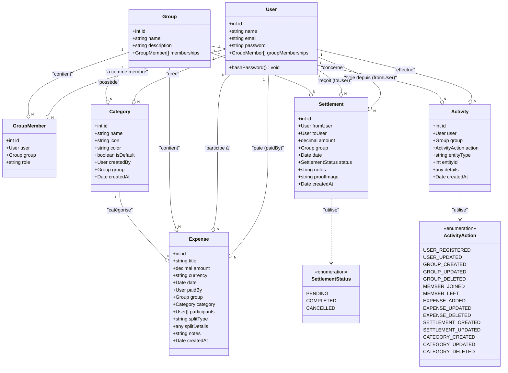

# 📐 Diagramme de Classes UML - MiniSplit

Ce document présente le diagramme de classes complet du système MiniSplit, illustrant toutes les entités, leurs attributs, méthodes et relations.

---

## 🎨 Diagramme Complet (Format Mermaid)



---

## 📊 Description Détaillée des Classes

### 🔷 **Classe `User`**

**Responsabilité** : Représente un utilisateur de l'application

| Attribut           | Type              | Description                                    |
|--------------------|-------------------|------------------------------------------------|
| `id`               | int               | Identifiant unique (PK, auto-increment)       |
| `name`             | string            | Nom de l'utilisateur                          |
| `email`            | string (unique)   | Email de connexion (unique)                   |
| `password`         | string            | Mot de passe hashé (bcrypt, exclu des réponses)|
| `groupMemberships` | GroupMember[]     | Liste des appartenances aux groupes           |

**Méthodes** :
- `hashPassword()` : Hook `@BeforeInsert()` qui hash automatiquement le mot de passe avec bcrypt (10 rounds) avant l'insertion en base

**Relations** :
- **OneToMany** vers `GroupMember` : Un utilisateur peut être membre de plusieurs groupes
- **OneToMany** vers `Expense` (paidBy) : Un utilisateur peut payer plusieurs dépenses
- **ManyToMany** vers `Expense` (participants) : Un utilisateur peut participer à plusieurs dépenses
- **OneToMany** vers `Category` : Un utilisateur peut créer plusieurs catégories
- **OneToMany** vers `Settlement` (fromUser) : Un utilisateur peut effectuer plusieurs remboursements
- **OneToMany** vers `Settlement` (toUser) : Un utilisateur peut recevoir plusieurs remboursements
- **OneToMany** vers `Activity` : Un utilisateur peut effectuer plusieurs activités

---

### 🔷 **Classe `Group`**

**Responsabilité** : Représente un groupe de dépenses partagées

| Attribut      | Type             | Description                           |
|---------------|------------------|---------------------------------------|
| `id`          | int              | Identifiant unique (PK)              |
| `name`        | string (unique)  | Nom du groupe (unique)               |
| `description` | string           | Description optionnelle du groupe    |
| `memberships` | GroupMember[]    | Liste des membres du groupe          |

**Relations** :
- **OneToMany** vers `GroupMember` : Un groupe contient plusieurs membres
- **OneToMany** vers `Expense` : Un groupe contient plusieurs dépenses
- **OneToMany** vers `Category` : Un groupe peut avoir plusieurs catégories personnalisées
- **OneToMany** vers `Settlement` : Un groupe peut avoir plusieurs remboursements
- **OneToMany** vers `Activity` : Un groupe peut avoir plusieurs activités enregistrées

---

### 🔷 **Classe `GroupMember`**

**Responsabilité** : Table de liaison Many-to-Many entre `User` et `Group`

| Attribut | Type   | Description                              |
|----------|--------|------------------------------------------|
| `id`     | int    | Identifiant unique (PK)                 |
| `user`   | User   | Référence vers l'utilisateur (FK)       |
| `group`  | Group  | Référence vers le groupe (FK)           |
| `role`   | string | Rôle de l'utilisateur (défaut: 'member')|

**Relations** :
- **ManyToOne** vers `User` : Un membre appartient à un utilisateur
- **ManyToOne** vers `Group` : Un membre appartient à un groupe

**Contraintes** :
- Un utilisateur ne peut pas être membre d'un groupe plusieurs fois (vérification métier)

---

### 🔷 **Classe `Expense`**

**Responsabilité** : Représente une dépense partagée dans un groupe

| Attribut       | Type          | Description                                    |
|----------------|---------------|------------------------------------------------|
| `id`           | int           | Identifiant unique (PK)                       |
| `title`        | string        | Titre/description de la dépense               |
| `amount`       | decimal(10,3) | Montant de la dépense (3 décimales)           |
| `currency`     | string        | Code de devise (défaut: 'TND')                |
| `date`         | Date          | Date de la dépense                            |
| `paidBy`       | User          | Utilisateur qui a payé la dépense             |
| `group`        | Group         | Groupe concerné par la dépense                |
| `category`     | Category      | Catégorie de la dépense (optionnel)           |
| `participants` | User[]        | Liste des utilisateurs participant à la dépense|
| `splitType`    | string        | Type de division (défaut: 'equal')            |
| `splitDetails` | any (JSONB)   | Détails de division personnalisée             |
| `notes`        | string        | Notes/commentaires supplémentaires            |
| `createdAt`    | Date          | Date de création de l'enregistrement          |

**Relations** :
- **ManyToOne** vers `User` (paidBy) : Qui a payé ?
- **ManyToOne** vers `Group` : Dans quel groupe ?
- **ManyToOne** vers `Category` : Quelle catégorie ? (nullable)
- **ManyToMany** vers `User` (participants) : Qui participe ? (via table `expense_participants`)

**Logique Métier** :
- Le montant doit être positif
- Au moins un participant requis
- Le champ `splitDetails` permet des divisions personnalisées (pourcentages, montants fixes, etc.)

---

### 🔷 **Classe `Category`**

**Responsabilité** : Catégorisation des dépenses

| Attribut     | Type    | Description                                      |
|--------------|---------|--------------------------------------------------|
| `id`         | int     | Identifiant unique (PK)                         |
| `name`       | string  | Nom de la catégorie                             |
| `icon`       | string  | Emoji/icône représentant la catégorie ('📦')    |
| `color`      | string  | Couleur hexadécimale ('#6366f1')                |
| `isDefault`  | boolean | Catégorie par défaut ? (non modifiable/supprimable)|
| `createdBy`  | User    | Utilisateur ayant créé la catégorie (nullable)  |
| `group`      | Group   | Groupe associé (nullable = catégorie globale)   |
| `createdAt`  | Date    | Date de création                                |

**Relations** :
- **ManyToOne** vers `User` (createdBy) : Qui a créé la catégorie ?
- **ManyToOne** vers `Group` : Catégorie spécifique à un groupe ou globale ?
- **OneToMany** vers `Expense` : Une catégorie peut être utilisée par plusieurs dépenses

**Logique Métier** :
- Les catégories par défaut (`isDefault = true`) ne peuvent pas être modifiées ou supprimées
- Les catégories avec `group = null` sont globales (visibles par tous)
- Les catégories avec un `group` spécifique sont visibles uniquement par ce groupe

---

### 🔷 **Classe `Settlement`**

**Responsabilité** : Représente un remboursement entre deux utilisateurs

| Attribut     | Type                | Description                                |
|--------------|---------------------|--------------------------------------------|
| `id`         | int                 | Identifiant unique (PK)                   |
| `fromUser`   | User                | Utilisateur qui paie le remboursement     |
| `toUser`     | User                | Utilisateur qui reçoit le remboursement   |
| `amount`     | decimal(10,3)       | Montant du remboursement                  |
| `group`      | Group               | Groupe concerné                           |
| `date`       | Date                | Date du remboursement                     |
| `status`     | SettlementStatus    | Statut du remboursement (enum)            |
| `notes`      | string              | Notes/commentaires (optionnel)            |
| `proofImage` | string              | URL de la preuve de paiement (optionnel)  |
| `createdAt`  | Date                | Date de création de l'enregistrement      |

**Relations** :
- **ManyToOne** vers `User` (fromUser) : Qui paie ?
- **ManyToOne** vers `User` (toUser) : Qui reçoit ?
- **ManyToOne** vers `Group` : Dans quel groupe ?

**Logique Métier** :
- Validation : `fromUser` ≠ `toUser` (un utilisateur ne peut pas se rembourser lui-même)
- Le montant doit être positif
- Statut par défaut : `COMPLETED`

---

### 🔷 **Classe `Activity`**

**Responsabilité** : Journal d'audit de toutes les actions dans l'application

| Attribut     | Type           | Description                                  |
|--------------|----------------|----------------------------------------------|
| `id`         | int            | Identifiant unique (PK)                     |
| `user`       | User           | Utilisateur ayant effectué l'action         |
| `group`      | Group          | Groupe concerné (nullable)                  |
| `action`     | ActivityAction | Type d'action effectuée (enum)              |
| `entityType` | string         | Type d'entité concernée (optionnel)         |
| `entityId`   | int            | ID de l'entité concernée (optionnel)        |
| `details`    | any (JSONB)    | Détails supplémentaires sur l'action        |
| `createdAt`  | Date           | Date et heure de l'action                   |

**Relations** :
- **ManyToOne** vers `User` : Qui a effectué l'action ?
- **ManyToOne** vers `Group` : Action liée à quel groupe ? (nullable)

**Logique Métier** :
- Les activités ne peuvent pas être modifiées ou supprimées (audit trail)
- Le champ `details` stocke des informations contextuelles en JSON

---

### 🔷 **Enum `ActivityAction`**

Liste exhaustive des actions traçables dans l'application :

| Valeur                | Description                        |
|-----------------------|------------------------------------|
| `USER_REGISTERED`     | Utilisateur inscrit                |
| `USER_UPDATED`        | Utilisateur mis à jour             |
| `GROUP_CREATED`       | Groupe créé                        |
| `GROUP_UPDATED`       | Groupe mis à jour                  |
| `GROUP_DELETED`       | Groupe supprimé                    |
| `MEMBER_JOINED`       | Membre ajouté au groupe            |
| `MEMBER_LEFT`         | Membre retiré du groupe            |
| `EXPENSE_ADDED`       | Dépense ajoutée                    |
| `EXPENSE_UPDATED`     | Dépense mise à jour                |
| `EXPENSE_DELETED`     | Dépense supprimée                  |
| `SETTLEMENT_CREATED`  | Remboursement créé                 |
| `SETTLEMENT_UPDATED`  | Remboursement mis à jour           |
| `CATEGORY_CREATED`    | Catégorie créée                    |
| `CATEGORY_UPDATED`    | Catégorie mise à jour              |
| `CATEGORY_DELETED`    | Catégorie supprimée                |

---

### 🔷 **Enum `SettlementStatus`**

États possibles d'un remboursement :

| Valeur       | Description                              |
|--------------|------------------------------------------|
| `PENDING`    | Remboursement en attente                |
| `COMPLETED`  | Remboursement complété (défaut)         |
| `CANCELLED`  | Remboursement annulé                    |

---

## 🔗 Résumé des Relations

### Relations Many-to-One (N:1)

| Entité Source   | Entité Cible | Attribut       | Description                            |
|-----------------|--------------|----------------|----------------------------------------|
| GroupMember     | User         | `user`         | Un membre appartient à un utilisateur |
| GroupMember     | Group        | `group`        | Un membre appartient à un groupe      |
| Expense         | User         | `paidBy`       | Une dépense est payée par un utilisateur|
| Expense         | Group        | `group`        | Une dépense appartient à un groupe    |
| Expense         | Category     | `category`     | Une dépense a une catégorie (nullable)|
| Category        | User         | `createdBy`    | Une catégorie est créée par un utilisateur|
| Category        | Group        | `group`        | Une catégorie appartient à un groupe (nullable)|
| Settlement      | User         | `fromUser`     | Un remboursement provient d'un utilisateur|
| Settlement      | User         | `toUser`       | Un remboursement va vers un utilisateur|
| Settlement      | Group        | `group`        | Un remboursement appartient à un groupe|
| Activity        | User         | `user`         | Une activité est effectuée par un utilisateur|
| Activity        | Group        | `group`        | Une activité concerne un groupe (nullable)|

### Relations One-to-Many (1:N)

| Entité Source | Entité Cible | Attribut           | Description                              |
|---------------|--------------|--------------------|------------------------------------------|
| User          | GroupMember  | `groupMemberships` | Un utilisateur a plusieurs appartenances|
| Group         | GroupMember  | `memberships`      | Un groupe a plusieurs membres           |
| Group         | Expense      | -                  | Un groupe a plusieurs dépenses          |
| User          | Expense      | -                  | Un utilisateur paie plusieurs dépenses  |
| User          | Category     | -                  | Un utilisateur crée plusieurs catégories|
| Group         | Category     | -                  | Un groupe a plusieurs catégories        |
| Category      | Expense      | -                  | Une catégorie a plusieurs dépenses      |
| User          | Settlement   | -                  | Un utilisateur effectue plusieurs remboursements|
| User          | Settlement   | -                  | Un utilisateur reçoit plusieurs remboursements|
| Group         | Settlement   | -                  | Un groupe a plusieurs remboursements    |
| User          | Activity     | -                  | Un utilisateur effectue plusieurs activités|
| Group         | Activity     | -                  | Un groupe a plusieurs activités         |

### Relations Many-to-Many (N:N)

| Entité 1 | Entité 2 | Table de Liaison       | Description                              |
|----------|----------|------------------------|------------------------------------------|
| User     | Group    | `group_member`         | Un utilisateur peut être dans plusieurs groupes, un groupe a plusieurs utilisateurs|
| User     | Expense  | `expense_participants` | Un utilisateur peut participer à plusieurs dépenses, une dépense a plusieurs participants|

---

## 🎯 Points Clés à Présenter au Jury

### 1. **Modélisation Relationnelle Complexe**
- Utilisation de tables de liaison pour les relations Many-to-Many
- Gestion des clés étrangères avec intégrité référentielle
- Support des relations nullable pour la flexibilité (category, group dans Category)

### 2. **Séparation des Préoccupations**
- Chaque entité a une responsabilité unique et claire
- Les relations sont bien définies et bidirectionnelles quand nécessaire

### 3. **Audit et Traçabilité**
- Système d'activités complet avec enum des actions
- Stockage de détails contextuels en JSONB

### 4. **Flexibilité et Extensibilité**
- Système de catégories globales et spécifiques aux groupes
- Support de différents types de divisions de dépenses (splitType + splitDetails)
- Statuts multiples pour les remboursements

### 5. **Sécurité**
- Hachage automatique des mots de passe via hook `@BeforeInsert`
- Exclusion du champ password des réponses via `@Exclude()`

---

## 📸 Diagramme Simplifié (Vue d'Ensemble)

```
        ┌───────┐
        │ User  │
        └───┬───┘
            │
    ┌───────┼───────┬───────────┬────────────┐
    │       │       │           │            │
    ▼       ▼       ▼           ▼            ▼
┌────────┐ ┌────────┐ ┌──────────┐ ┌─────────┐ ┌──────────┐
│GroupMbr│ │Expense │ │Category  │ │Settlement│ │Activity  │
└───┬────┘ └───┬────┘ └────┬─────┘ └────┬────┘ └────┬─────┘
    │          │           │            │           │
    ▼          ▼           │            ▼           │
┌────────┐ ┌────────┐     │        ┌────────┐     │
│ Group  │ │ Group  │     │        │ Group  │     │
└────────┘ └───┬────┘     │        └────────┘     │
               │           │                       │
               ▼           │                       │
           ┌────────┐      │                       │
           │Category│◄─────┘                       │
           └────────┘                              │
                                                   │
           ┌────────┐                              │
           │ Group  │◄─────────────────────────────┘
           └────────┘
```

---

**Document généré pour la présentation au jury**  
**Version** : 1.0  
**Date** : Décembre 2025
